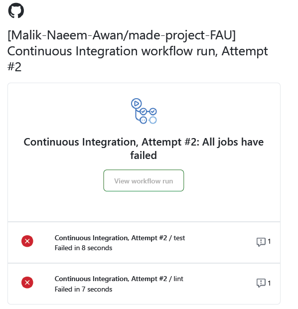

> _This repository contains data engineering and data science projects and exercises using open data sources as part of the [AMSE](https://oss.cs.fau.de/teaching/specific/amse/)/[SAKI](https://oss.cs.fau.de/teaching/specific/saki/) course, taught by the [FAU Chair for Open-Source Software (OSS)](https://oss.cs.fau.de/) in the Winter'23 semester. This repo is forked from [2023-amse-template repository](https://github.com/jvalue/made-template)._

The task was to build a Data Engineering Project, which takes at least two public available datasources and processes them with an automated datapipeline, in order to report some findings from the result.
<!--


-->
<p align="center">
  
</p>
<div style="text-align: center;">

# # Netherlands R&D Expenditure in relation with Employees from Abroad.

[](https://opensource.org/license/mit/)
[](https://github.com/Malik-Naeem-Awan/made-project-FAU/actions/workflows/Project_feedback.yml)
[](https://www.python.org)

</div>

## Overview
The aim of this project is to investigate if there is a relationship between the R&D Expenditure and employees working in the Netherland who are from abroad. Therefore it uses open available datasources provided by
 <br>

[](https://opendata.cbs.nl/statline/#/CBS/en/)
[](https://data.europa.eu/en)
 <br>

For details see the [project plan](https://github.com/Malik-Naeem-Awan/made-project-FAU/blob/main/project/project-plan.md).


## Project Structure

```bash
project/
├── pipeline.py                 # ETL data pipeline implementation
├── pipeline.sh                 # Bash script for running the datapipeline for ETL
├── requirements.txt            # Dependencies for external libraries
├── test_pipeline.py            # Test cases for component & Systems testing
├── tests.sh                    # Bash script for running all the test cases
├── Know_data_sources.ipynb     # Notebook for data exploration
├── report.ipynb                # Notebook for final project project
└── project-plan.md             # Project plan and documentation
```

**Important files of the project and their roles:**

- `project/pipiline.sh`: The Bash script will run an automated ETL pipeline that creates an SQLite databases named  `employees_data.sqlite` & `R&D_Expenditure.sqlite` that contain tables representing two open data sources of the project.
- `project/tests.sh`: A bash script that will execute the component and system-level testing for the project.
- `project/report.ipynb`: This Jupyter notebook serves as the final report for the project, providing a comprehensive exploration of all aspects and findings. The report primarily investigates to identify how much of the increased rate of employees from abroad is related to the increase in Netherlands R&D expenditure in whole country over the years from 2013 to 2017, addressing various key questions, based on the data in `employees_data.sqlite` & `R&D_Expenditure.sqlite`. See the [report](project/report.ipynb).

**Continuous Integration Pipeline using GitHub Action:** <br>

A Continuous Integration pipeline has been implemented using a GitHub action defined in [Continuous Integration](.github/workflows/Project_feedback.yml). This pipeline is triggered whenever changes are made to the `project/` directory (with a few exceptions: `Know_data_sources.ipynb`, `report.ipynb`, `project-plan.md`) and pushed to the GitHub repository, or when a pull request is created and merged into the `main` branch. The `Project_feedback.yml` workflow executes the `project/tests.sh` test script, and in case of any failures, it sends an error message to the owner [Email](https://gmail.com/), as shown in the sample screenshot below:



## Project Setup

1. Clone this git repository
```bash
git clone git@github.com:Malik-Naeem-Awan/made-project-FAU.git
```
2. Install [Python](https://www.python.org/). Then create a virtual environment inside the repo and activate it.
```bash
python3 -m venv <env_name>
source <env_name>/bin/activate
```
3. Go to the `project/` directory, Download and install the required Python packages for the project.
```bash
pip install -r requirements.txt
```
4. To run the project, go to the `project/` directory and run the `pipeline.sh` bash script. It will run the whole ETL pipeline and generate SQLite databases named `employees_data.sqlite` & `R&D_Expenditure.sqlite` that contains tables, `employees` and `R&D_Expenditure`, representing two open data sources of the project.
```bash
chmod +x pipeline.sh
sh pipeline.sh
```
5. To run the test script which will execute the component and system-level testing for the project, run the following command.
```bash
chmod +x tests.sh
sh tests.sh
```
6. Finally, run and explore the `project/report.ipynb` project notebook, and also feel free to modify it.

## Exercises (not part of the project)

During the semester we had to complete exercises, sometimes using [Python](https://www.python.org/), and sometimes using [Jayvee](https://github.com/jvalue/jayvee). Automated exercise feedback is provided using a GitHub action that is defined in [.github/workflows/exercise-feedback.yml](.github/workflows/exercise-feedback.yml).

1. [exercises/exercise1.jv](exercises/exercise1.jv)
2. [exercises/exercise2.py](exercises/exercise2.py)
3. [exercises/exercise3.jv](exercises/exercise3.jv)
4. [exercises/exercise4.py](exercises/exercise4.py)
5. [exercises/exercise5.jv](exercises/exercise5.jv)

The exercise feedback is executed whenever we make a change in files in the `exercise/` directory and push our local changes to the repository on GitHub. To see the feedback, open the latest GitHub Action run, and open the `exercise-feedback` job and `Exercise Feedback` steps executed.
